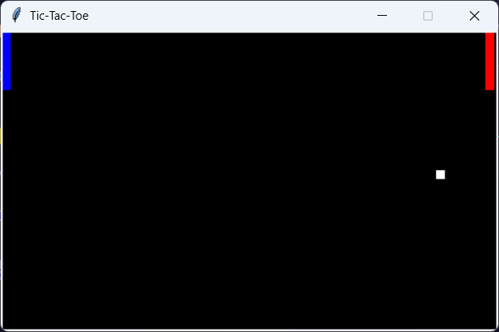
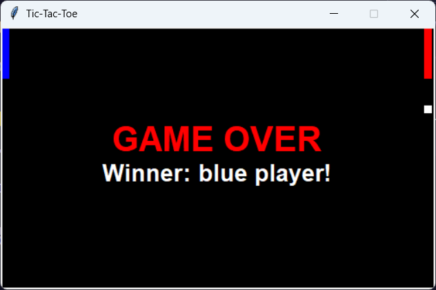

# 🏓 Ping-Pong Game 🏓

A simple 2-player Ping-Pong game implemented using Python and the Tkinter library.

## 🎮 Features

- Two players can control paddles to hit the ball.
- Player 1 (Blue) controls the paddle using the keys `A` (move up) and `Q` (move down).
- Player 2 (Red) controls the paddle using the keys `P` (move up) and `M` (move down).
- The ball moves diagonally and bounces off the walls and paddles.
- The game ends when the ball crosses one player's paddle.

## 🚀 Instructions

1. **Objective**: Use your paddle to hit the ball and prevent it from crossing your side. Try to make the ball cross your opponent's side.
2. **Player Controls**:
   - **Player 1 (Blue)**:
     - Press `A` to move the paddle up.
     - Press `Q` to move the paddle down.
   - **Player 2 (Red)**:
     - Press `P` to move the paddle up.
     - Press `M` to move the paddle down.
3. **Game Over**: The game ends when the ball passes a player's paddle. The winner will be displayed on the screen.

## 💻 How to Run

1. Clone the repository:
   ```bash
   git clone <repository-url>
   ```

2. Navigate into the project directory:
   ```bash
   cd ping_pong
   ```

3. Run the game:
   ```bash
   python main.py
   ```

### 🖥️ Platform-Specific Notes

- **Windows**: Tkinter should be pre-installed with Python.
- **Linux**: If Tkinter is not installed, use the following command to install it:
  ```bash
  sudo apt-get install python3-tk
  ```

### 🖼️ Screenshot

|         |         |
|---------|---------|
|  |  |

## 📽️ Demo

- You can view a demo by following this [link](https://drive.google.com/file/d/1oxn-ZCHwEZJoFzZ-yySarnwbzhxKvP-0/view?usp=sharing).