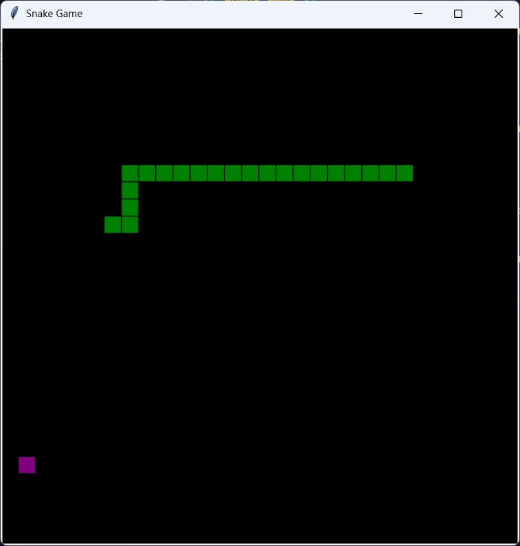
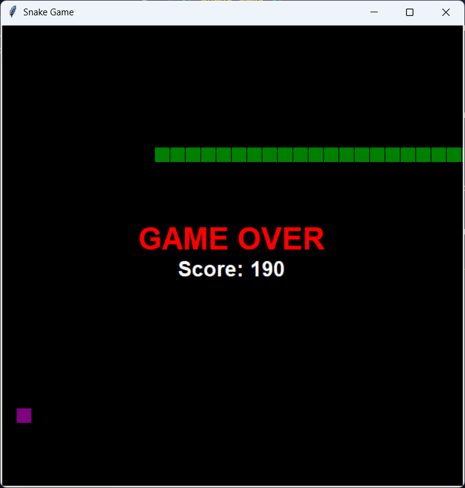

# 🐍 Snake Game 🐍

A simple implementation of the classic Snake game using Python and the Tkinter library.

## 🎮 Features

- Control the snake with the arrow keys (`Up`, `Down`, `Left`, `Right`).
- The snake grows in size when it eats food. 🍏
- The game ends if the snake collides with the wall or itself. 💥
- The score increases by 10 each time the snake eats food. 🎯

## 🚀 Instructions
   
2. **Objective**: Eat the purple food 🍇 to increase your score and make the snake grow longer. Avoid hitting the walls or your own body. 🚫

3. **Game Over**: The game ends if the snake runs into a wall or itself. The final score will be displayed. 🏁

## 💻 How to Run

1. Clone the repository:
   ```bash
   git clone <repository-url>
   ```

2. Navigate into the project directory:
   ```bash
   cd snake_game
   ```

3. Run the game:
   ```bash
   python main.py
   ```

### 🖥️ Platform-Specific Notes

- **Windows**: Tkinter is usually already installed with Python, so no additional steps are required.
- **Linux**: If Tkinter is not installed, you can install it using the following command:
  ```bash
  sudo apt-get install python3-tk
  ```

## 🎮 Game Controls

- Arrow Keys (`⬆️`, `⬇️`, `⬅️`, `➡️`): Control the snake's movement.

|         |         |
|---------|---------|
|  |  |

## 📽️ Demo
- You can view the demo by following this [link](https://drive.google.com/file/d/1MGCUfDa_M2dILiT1QBiox_HyKkcQ5y_y/view?usp=sharing).