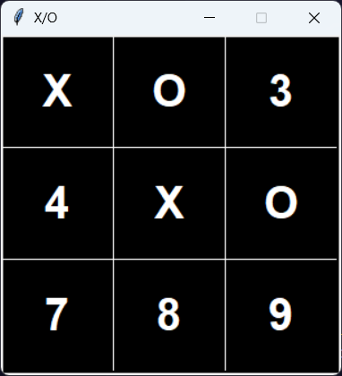
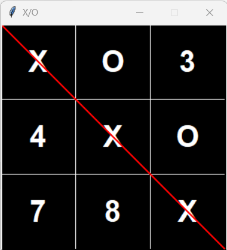

# 🧩 Tic-Tac-Toe Game 🧩

A simple implementation of the classic Tic-Tac-Toe game using Python and the Tkinter library.

## 🎮 Features

- **Interactive Gameplay**: Play Tic-Tac-Toe directly on the screen using number keys (`1-9`).
- **Dynamic Turn Switching**: Automatically alternates turns between players `X` and `O`.
- **Winner Highlight**: Highlights the winning row, column, or diagonal in red.
- **Tie Detection**: Displays a message in case of a tie. 🎉

## 🚀 How to Play

1. Use the number keys (`1-9`) to select a position on the board:
   - Positions correspond to a grid:
     ```
     1 | 2 | 3
     ---------
     4 | 5 | 6
     ---------
     7 | 8 | 9
     ```

2. Players alternate turns, starting with `X`.

3. The game ends when:
   - A player forms a straight line of three (`X` or `O`).
   - All positions are filled without a winner, resulting in a tie.

## 💻 How to Run

1. Clone the repository:
   ```bash
   git clone <repository-url>
   ```

2. Navigate to the project directory:
   ```bash
   cd tic_tac_toe
   ```

3. Run the game:
   ```bash
   python main.py
   ```

### 🖥️ Platform-Specific Notes

- **Windows**: Tkinter is usually already installed with Python, so no additional steps are required.
- **Linux**: If Tkinter is not installed, you can install it using the following command:
  ```bash
  sudo apt-get install python3-tk
  ```

### 🖼️ Screenshot

|         |         |
|---------|---------|
|  |  |

## 📽️ Demo
- You can view the demo by following this [link](https://drive.google.com/file/d/1My4nKpG2iNLHN4bnbUGSSurhwH1KBIfI/view?usp=sharing).